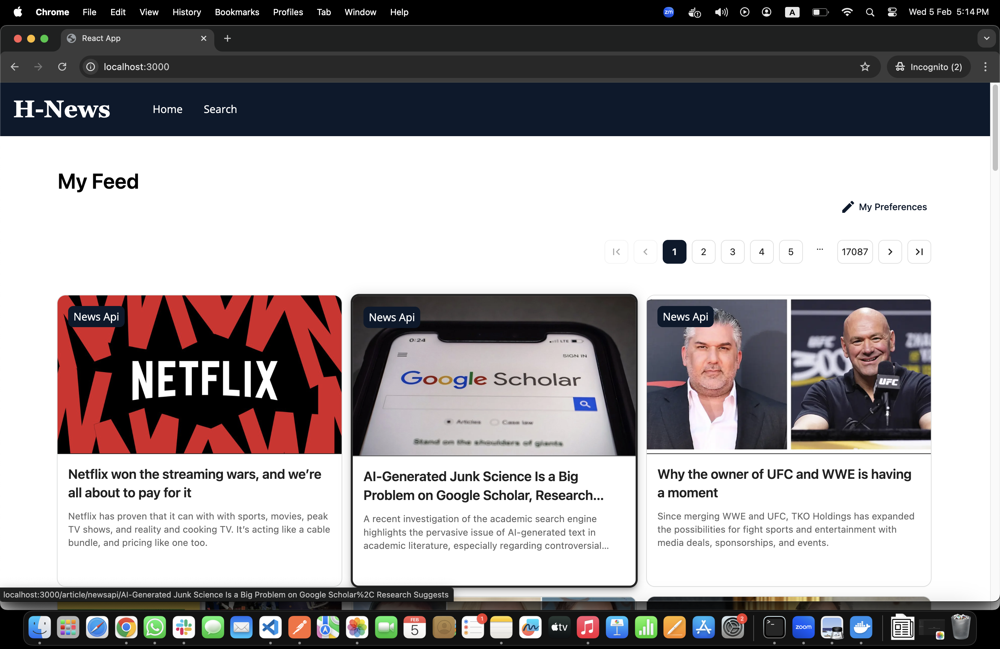
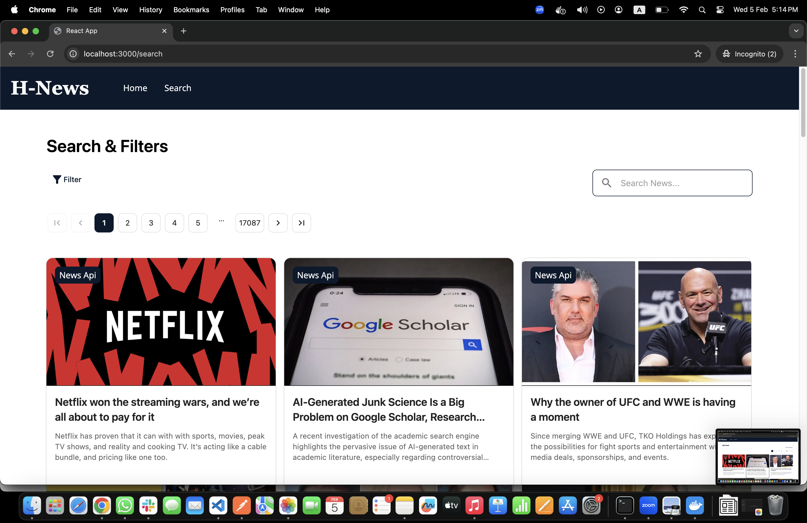

# Hyder News App

A news aggregation application built with React, integrating The Guardian, News API, and New York Times APIs.

## Demo

### Home Page

*News feed showing latest articles from multiple sources*

### Article View

*Detailed article view with source attribution*

### Search Results

*Search interface with filters and sorting options*


## Technology Stack

- **React 18**
  - Modern UI library for building responsive user interfaces
  - Leveraging latest features like automatic batching and concurrent rendering

- **Material-UI (MUI)**
  - Component library providing pre-built, customizable React components
  - Implements Material Design principles for consistent UI/UX
  - Used for core interface components and responsive layouts

- **Tailwind CSS**
  - Utility-first CSS framework
  - Used alongside MUI for custom styling and responsive design
  - Enables rapid UI development with pre-built utility classes

- **React Context**
  - State management solution for application-wide data
  - Manages theme, authentication, and global application state
  - Provides a lightweight alternative to Redux for this scale of application

- **React Query**
  - Data-fetching and state management library
  - Handles API caching, loading states, and data synchronization
  - Provides optimistic updates and automatic background refetching

- **Docker**
  - Containerization for consistent development and deployment environments
  - Nginx-based production build for optimal performance
  - Simplifies deployment and ensures application portability

## Prerequisites

Before you begin, ensure you have the following installed:
- Node.js (16.x or higher)
- npm or yarn
- Docker

## Environment Variables

The application requires the following API keys:
```env
REACT_APP_GUARDIAN_API_KEY=your_guardian_api_key
REACT_APP_NEWS_API_KEY=your_news_api_key
REACT_APP_NYT_API_KEY=your_nyt_api_key
```

## Installation

### Local Development

1. Clone the repository:
```bash
git clone [your-repository-url]
cd hyder-news-app
```

2. Install dependencies:
```bash
npm install
# or
yarn install
```

3. Start the development server:
```bash
npm start
# or
yarn start
```

The app will be available at `http://localhost:3000`

### Docker Setup

1. Build the Docker image:
```bash
docker build \
  --build-arg REACT_APP_GUARDIAN_API_KEY=your_guardian_api_key \
  --build-arg REACT_APP_NEWS_API_KEY=your_news_api_key \
  --build-arg REACT_APP_NYT_API_KEY=your_nyt_api_key \
  -t hyder-news-app .
```

2. Run the container:
```bash
docker run -p 80:80 hyder-news-app
```

The app will be available at `http://localhost`

Alternatively, if port 80 is in use:
```bash
docker run -p 8080:80 hyder-news-app
```

The app will then be available at `http://localhost:8080`

### Docker Commands Reference

Stop the container:
```bash
docker ps # get the container ID
docker stop <container-id>
```

View container logs:
```bash
docker logs <container-id>
```

## Project Structure

```
src/
├── api/                  # API integration and service calls
│   ├── query/           # React Query hooks and configurations
│   ├── utils/           # API utilities and parsers
│   └── axios/           # Axios service configuration and interceptors
├── components/          # React components
│   ├── ui/             # Reusable MUI component library
│   └── [ComponentName] # Feature-specific components
├── contexts/           # React Context providers and hooks
├── pages/              # Route components and page layouts
├── theme/              # MUI theme configuration
│   ├── palette/        # Color schemes
│   ├── typography/     # Font settings
│   └── components/     # Component-specific theme overrides
└── types/              # TypeScript type definitions and interfaces
```

### Directory Details

- **api/**
  - `query/`: React Query configurations for data fetching and caching
  - `utils/`: Parser utilities and API helper functions
  - `axios/`: Centralized Axios instance and interceptor configuration

- **components/**
  - `ui/`: Reusable Material-UI components (buttons, inputs, etc.)
  - Feature-specific components organized by functionality

- **contexts/**
  - Application-wide state management using React Context API
  - Context providers and custom hooks

- **theme/**
  - Material-UI theme customization
  - Global styling configurations
  - Component style overrides


## Available Scripts

In the project directory, you can run:

### `npm start`

Runs the app in the development mode.\
Open [http://localhost:3000](http://localhost:3000) to view it in your browser.

### `npm test`

Launches the test runner in the interactive watch mode.

### `npm run build`

Builds the app for production to the `build` folder.

### `npm run eject`

**Note: this is a one-way operation. Once you `eject`, you can't go back!**
